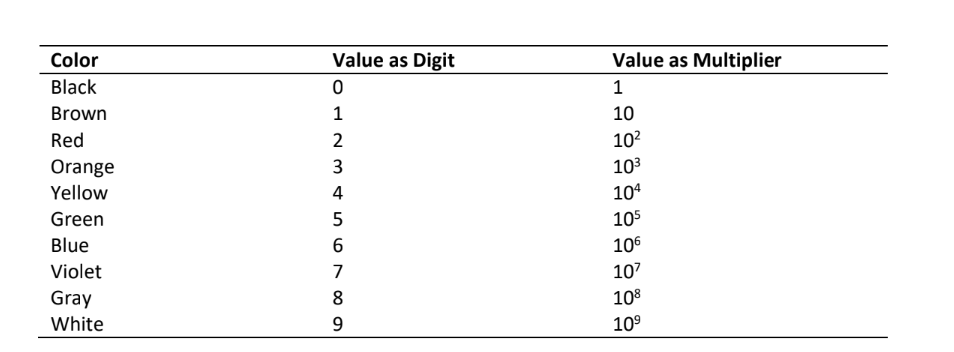

# Case Study #1 - Individual or By Group (of Four)

## Intravenous Rate Assistant

A hospital supply company wants to market a program to assist with the calculation of intravenous
rates. Design and implement a program that interacts with the user as follows:

```sample run
INTRAVENOUS RATE ASSISTANT

Enter the number of the problem you wish to solve.
        GIVEN A MEDICAL ORDER IN            CALCULATE RATE IN
(1)     ml/hr & tubing drop factor              drops / min
(2)     1 L for n hr                            ml  / hr
(3)     mg/kg/hr & concentration in mg/ml       ml / hr
(4)     units/hr & concentration in units/ml    ml / hr
(5)     QUIT
Problem => 1
Enter rate in ml/hr=> 150
Enter tubing’s drop factor (drops/ml)=> 15
The drop rate per minute is 38.

Enter the number of the problem you wish to solve.
       GIVEN A MEDICAL ORDER IN             CALCULATE RATE IN
(1)    ml/hr & tubing drop factor               drops / min
(2)    1 L for n hr                             ml / hr
(3)    mg/kg/hr & concentration in mg/ml        ml / hr
(4)    units/hr & concentration in units/ml     ml / hr
(5)    QUIT
Problem => 2
Enter number of hours=> 8
The rate in milliliters per hour is 125.

Enter the number of the problem you wish to solve.
       GIVEN A MEDICAL ORDER IN             CALCULATE RATE IN
(1)    ml/hr & tubing drop factor                drops / min
(2)    1 L for n hr                              ml / hr
(3)    mg/kg/hr & concentration in mg/ml         ml / hr
(4)    units/hr & concentration in units/ml      ml / hr
(5)    QUIT
Problem => 3
Enter rate in mg/kg/hr=> 0.6
Enter patient weight in kg=> 70
Enter concentration in mg/ml=> 1
The rate in milliliters per hour is 42.

Enter the number of the problem you wish to solve.
       GIVEN A MEDICAL ORDER IN             CALCULATE RATE IN
(1)    ml/hr & tubing drop factor                drops / min
(2)    1 L for n hr                              ml / hr
(3)    mg/kg/hr & concentration in mg/ml         ml / hr
(4)    units/hr & concentration in units/ml      ml / hr
(5)    QUIT
Problem => 4
Enter rate in units/hr=> 1000
Enter concentration in units/ml=> 25
The rate in milliliters per hour is 40.

Enter the number of the problem you wish to solve.
       GIVEN A MEDICAL ORDER IN             CALCULATE RATE IN
(1)    ml/hr & tubing drop factor                drops / min
(2)    1 L for n hr                              ml / hr
(3)    mg/kg/hr & concentration in mg/ml         ml / hr
(4)    units/hr & concentration in units/ml      ml / hr
(5)    QUIT
Problem => 5
```

The following functions should be implemented. \
`get_problem` – Displays the user menu, then inputs and returns as the function value the problem number selected. \
`get_rate_drop_factor` – Prompts the user to enter the data required for problem 1, and sends
this data back to the calling module via output parameters. \
`get_kg_rate_conc` – Prompts the user to enter the data required for problem 3, and sends this
data back to the calling module via output parameters. \
`get_units_conc` – Prompts the user to enter the data required for problem 4, and sends this data
back to the calling module via output parameters. \
`fig_drops_min` – Takes rate and drop factor as input parameters and returns $drops/min$ *(rounded
to nearest whole drop)* as function value. \
`fig_ml_hr` – Takes as an input parameter the number of hours over which one liter is to be
delivered and returns $ml/hr$ (rounded) as function value. \
`by_weight` – Takes as input parameters rate in $mg/kg/hr$, patient weight in $kg$, and concentration
of drug in $mg/ml$ and returns $ml/hr$ (*rounded*) as function value. \
`by_units` – Takes as input parameters rate in units/hr and concentration in $units/ml$, and returns
$ml/hr$ (rounded) as function value.

**HINT**: Use a sentinel-controlled loop. Call `get_problem` once before the loop to initialize the
problem number and once again at the end of the loop body to update it.

## Non-vertical Straight Lines

The table below summarizes three commonly used mathematical models of non vertical straight
lines. \


Design and implement a program that permits the user to convert either two-point form or point-
slope form into slope-intercept form. Your program should interact with the user as follows:

```sample run
Select the form that you would like to convert to slope-intercept
form:
1) Two-point form (you know the points on the line)
2) Point–slope form (you know the line’s slope and one point)
=> 2

Enter the slope=> 4.2
Enter the x-y coordinates of the point separated by a space=> 1 1

Point-slope form
       y – 1.00 = 4.20 (x – 1.00)

Slope-intercept form
       y = 4.20x – 3.20

Do another conversion (Y or N)=> Y

Select the form that you would like to convert to slope-intercept
form:
1) Two-point form (you know the points on the line)
2) Point–slope form (you know the line’s slope and one point)
=> 1

Enter the x-y coordinates of the first point separated by a space=>
4 3
Enter the x-y coordinates of the second point separated by a space=>
-2 1

Two-point form
      (1.00 – 3.00)
m = ----------------
      (-2.00 – 4.00)

Slope-intercept form
y = 0.33x + 1.66

Do another conversion (Y or N)=> N
```

Implement the following functions:\
`get_problem` – Displays the user menu, then inputs and returns as the function value the problem
number selected.\
`get2_pt` – Prompts the user for the x-y coordinates of both points, inputs the four coordinates,
and returns them to the calling function through output parameters.\
`get_pt_slope` – Prompts the user for the slope and x-y coordinates of the point, inputs the three
values and returns them to the calling function through output parameters.
`slope_intcpt_from2_pt` – Takes four input parameters, the x-y coordinates of two points, and
returns through output parameters the slope (m) and y-intercept (b).
`intcpt_from_pt_slope` – Takes three input parameters, the x-y coordinates of one point and the
slope, and returns as the function value the y-intercept.\
`display2_pt` – Takes four input parameters, the x-y coordinates of two points, and displays the
two-point line equation with a heading.\
`display_pt_slope` – Takes three input parameters, the x-y coordinates of one point and the slope,
and displays the point-slope line equation with a heading.
`display_slope_intcpt`– Takes two input parameters, the slope and y-intercept, and displays the
slope-intercept line equation with a heading.

# ΩMG

A resistor is a circuit device designed to have a specific resistance value between its ends.
Resistance values are expressed in ohms $(Ω)$ or kilo-ohms $(kΩ)$. Resistors are frequently marked
with colored bands that encode their resistance values, as shown in the figure. The first two bands
are digits, and the third is a power-of-ten multiplier.


The table below shows the meanings of each band color. For example, if the first band is green,
the second band is black, and the third is orange, the resistor has a value of $50 \times 103Ω$ or $50 kΩ$.

The information in the table can be stored in a C program as an array of strings.

`char COLOR_CODES[10] [7] = {“black”, “brown”, “red”, “orange”, “yellow”, “green”, “blue”, “violet”, “gray”, “white”};`

Notice that “red” is `COLOR_CODES[2]` and has a digit value of $2$ and a multiplier value of $10^2$. In
general, `COLOR_CODES[n]` has digit value `n` and multiplier value $10^n$.



Write a program that prompts for the colors of Band 1, Band 2, and Band 3, and then displays the
resistance in kilo-ohms. Include a helper function search that takes three parameters – the list
of strings, the size of the list, and a target string, and returns the subscript of the list element that
matches the target or returns -1 if the target is not in the list. Here is a short sample run.

```sample run
Enter the colors of the resistor’s three bands, beginning with the band nearest the end. Type the colors in lowercase letters only,
NO CAPS.
Band 1 => green
Band 2 => black
Band 3 => yellow
Resistance value: 500 kilo-ohms
Do you want to decode another resistor?
=> y

Enter the colors of the resistor’s three bands, beginning with the
band nearest the end. Type the colors in lowercase letters only,
NO CAPS.
Band 1 => brown
Band 2 => vilet
Band 3 => gray
Invalid color: vilet
Do you want to decode another resistor?
=> n
```
